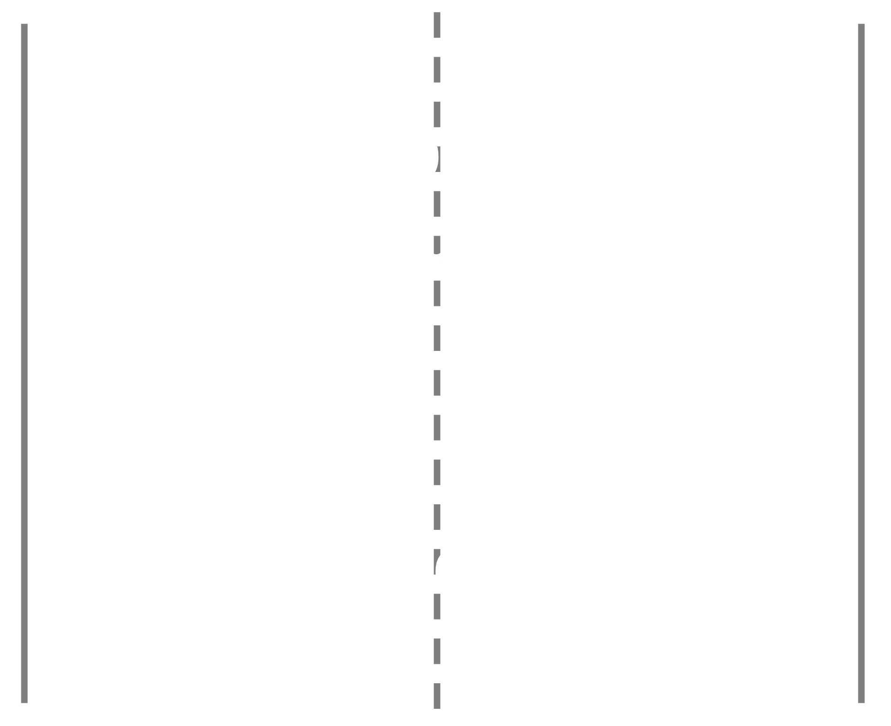

```{r setup, include=FALSE}
library(knitr)
library(tidyverse)
library(fontawesome)
library(metathis)

options(
  htmltools.dir.version = FALSE,
  knitr.table.format = "html",
  knitr.kable.NA = '',
  dplyr.width = Inf,
  width = 250
)

knitr::opts_chunk$set(
  cache = FALSE,
  warning = FALSE,
  message = FALSE,
  fig.path = "figs/",
  fig.width = 7.252,
  fig.height = 4,
  comment = "#>",
  fig.retina = 3
)

# Setup xaringanExtra options
xaringanExtra::use_xaringan_extra(c(
  "tile_view", "panelset", "clipboard", "share_again"))
xaringanExtra::style_share_again(share_buttons = "none")
xaringanExtra::use_extra_styles(
  hover_code_line = TRUE,
  mute_unhighlighted_code = FALSE
)

# Set up website metadata
meta() %>%
  meta_general(
    description = rmarkdown::metadata$subtitle,
    generator = "xaringan and remark.js"
  ) %>%
  meta_name("github-repo" = "jhelvy/intro") %>%
  meta_social(
    title = rmarkdown::metadata$title,
    url = "https://jhelvy.github.io/intro/",
    og_type = "website",
    og_author = "John Paul Helveston",
    twitter_card_type = "summary_large_image",
    twitter_creator = "@johnhelveston"
  )
```

class: middle, inverse

.leftcol40[
<center>

</center>
]

.rightcol60[
### `r fontawesome::fa(name = "user", fill = "white")` `r rmarkdown::metadata$author`
### `r fontawesome::fa(name = "university", fill = "white")` `r rmarkdown::metadata$institute`
### `r fontawesome::fa(name = "calendar-alt", fill = "white")` `r rmarkdown::metadata$date`
]

---

# Hello World!

.leftcol30[.circle[

]]
.rightcol70[

### John Paul Helveston, Ph.D.

.font80[
Assistant Professor, Engineering Management & Systems Engineering
Website: [www.jhelvy.com](http://www.jhelvy.com/)

- 2010 BS in Engineering Science & Mechanics at Virginia Tech
- 2015 MS in Engineering & Public Policy at Carnegie Mellon University
- 2016 PhD in Engineering & Public Policy at Carnegie Mellon University
- 2016-2018 Postdoc at [Institute for Sustainable Energy](https://www.bu.edu/ise/), Boston University
]]

---

class: center, middle
 
.cols3[
### .center[I swing dance]
<center>

</center>
]

--

.cols3[
### .center[I worked in China]
<center>

</center>
]

--

.cols3[
### .center[I swing danced in China]
<center>

</center>
]

---

class: center, middle

# I use `r fontawesome::fa(name = "r-project", fill = "#276DC2")` for everything

<br>

--

### ...seriously...even [these slides](https://github.com/jhelvy/intro)

---

class: center, middle
 
.cols3[
### .center[[EMSE 4571:](https://p4a.seas.gwu.edu/)<br>Intro to Programming for Analytics]
<center>

</center>
]

--

.cols3[
### .center[[EMSE 4572:](https://eda.seas.gwu.edu/)<br>Exploratory Data Analysis]
<center>

</center>
]

--

.cols3[
### .center[[EMSE 6035:](https://madd.seas.gwu.edu/)<br>Marketing Analytics for Design Decisions]
<center>

</center>
]

---

class: center

## Technology Change Lab 

<center>

</center>

---

class: center

## Technology Change Lab 

> I study how consumers, firms, markets, and policies affect technology change, with a goal of accelerating transitions to environmentally sustainable and low-carbon technologies.

.cols3[
### .center[Electric & Sustainable Vehicle Technologies]
<center>

</center>
]

.cols3[
### .center[Market & Policy Analysis]
<center>

</center>
]

.cols3[
### .center[U.S. - China Climate Relationship]
<center>

</center>
]


---

## I'm interested in questions like...

<br>

--

### - How can we get people to buy more efficient vehicles?

--

### - How will emerging technology like autonomous and electric vehicles compete against existing technologies in the market?

--

### - Would people be willing to pay a premium to reduce pollution? 

--

## **Answers depend on knowing what people want**

---

class: center 

## Directly asking people what they want isn't always helpful

--

## (People want everything)

<center>

</center>

---

class: center, middle 

## Which feature do you care more about?

<center>

</center>

.cols3[
## .center[Battery Life?]
<center>

</center>
]

.cols3[
## .center[Brand?]
<center>

</center>
]

.cols3[
## .center[Signal quality?]
<center>

</center>
]

---

class: center

## **Conjoint approach**:<br>Use consumer choice data to model preferences

<center>

</center>

---

### .center[Use random utility framework to predict probability of choosing phone _j_]

<br>

--

### 1. $u_j = \beta_1\mathrm{price}_j + \beta_2\mathrm{brand}_j + \beta_3\mathrm{battery}_j + \beta_4\mathrm{signal}_j + \varepsilon_j$

--

### 2. Assume $\varepsilon_j \sim$ iid extreme value 

--

### 3. Probability of choosing phone _j_: $P_j = \frac{e^{\beta'x_j}}{\sum_k^J e^{\beta'x_k}}$

--

### 4. Estimate $\beta_1$, $\beta_2$, $\beta_3$, $\beta_4$ via maximum likelihood estimation 

---

class: center 

.leftcol[.center[
## **Willingness to Pay**

<br>

.font140["Respondents on average are willing to pay $XX to improve battery life by XX%"]

## $u_j = \beta'x_j + \alpha p_j + \varepsilon_j$ 

## $\omega = \frac{\beta}{-\alpha}$
]]

--

.rightcol[
## **Make predictions**

### $P_j = \frac{e^{\hat{\beta}'x_j}}{\sum_k^J e^{\hat{\beta}'x_k}}$

<center>

</center>
]

---


